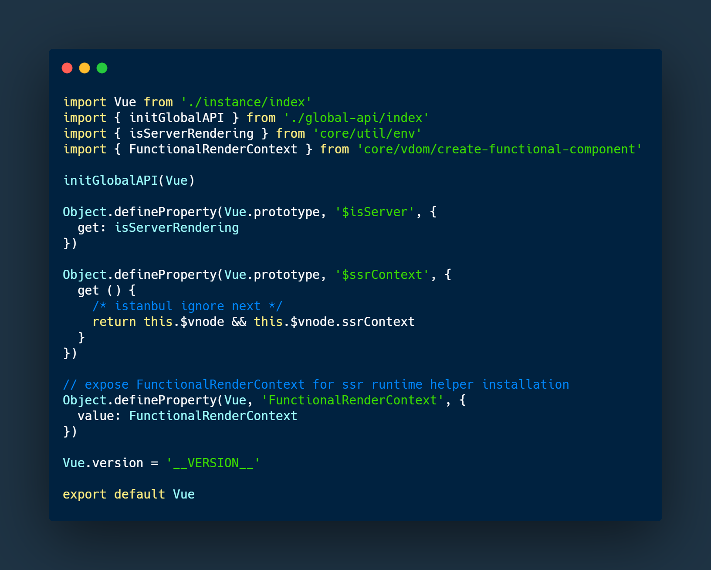
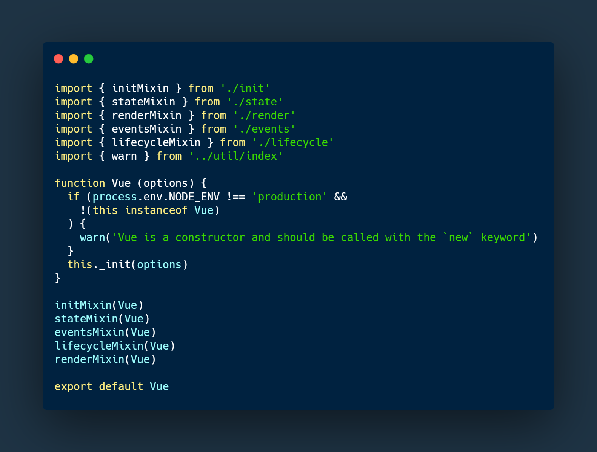
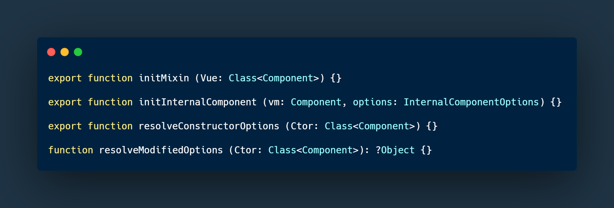
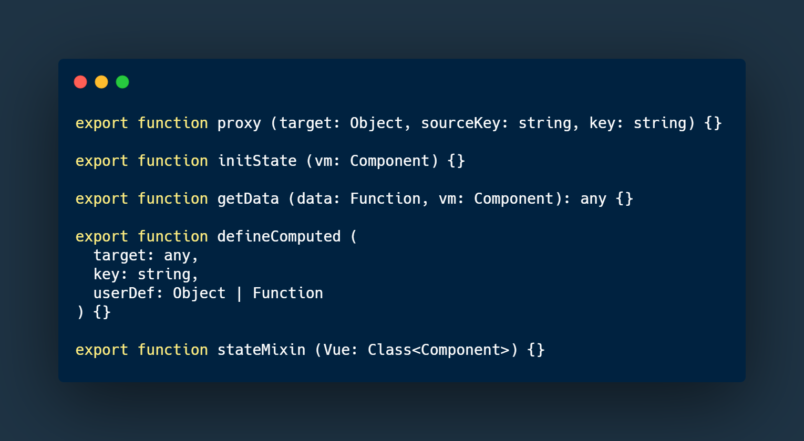

## vue 源码 version 2.6
* 根据目录结构 `src/core/index.js` 为起始文件。其中内容分别是 vue实例 `./instance/index.js`, 公共api `./global-api/index`
    是否服务端渲染 `core/util/env` 和 上下文构成 `core/vdom/create-functional-component`
    
    
    
* 从 `instance/index`可以看出，一个 vue实例 会混入一些 `init` `state` `render` `events` `lifecycle`

    

* `instance/init` 中一共抛出3个方法，分别为 初始化 `initMixin`, 初始化内部组件 `initInternalComponent`,
    解析构造器属性 `resolveConstructorOptions`。 
    
    
    
    `initMixin` 主要定义一个 `_init` 函数接受一个参数类型为 `Object` 的Options，在 `instance/index` 里一个 Vue 实例生成会调用内部的 `_init` 方法，
    而这个 `_init` 就是由 `initMixin` 定义的。 这个 `_init` 函数会根据 `Options` 参数判断这个实例是否是个 `component` 分别调用 `iniInternalComponent`
    和 `resolveConstructorOptions`，同时接下来会调用一系列方法初始话实例的`lifecycle` `events` `render` `injections` `state` `provide`
    , 这些初始化方法调用的时候也调用了 `beforCreate` `created` 两个 `hook` 

* `instance/state` 抛出5个方法，`proxy` `iniState` `getData` `defineComputed` `stateMixin`。 根据前面代码，`initState` 会在一个`vm`
    实例初始化时候调用，也就是调用`_init`方法时初始化一些属性。`stateMixin`是对`Vue`这个构造函数在其`prototype`属性上一些方法，这样`vm`实例能够继承这些方法(具体可以参考原型链这方面知识)。

    
    
    `initState` 根据`vm`的`$options`属性，调用`initProps` `initMethods` `initData` `observe` `initComputed` `iniWatch`初始化`vm`的属性。